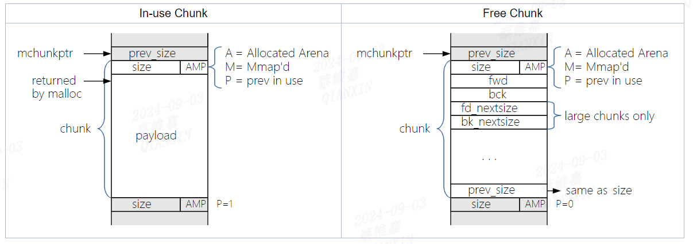
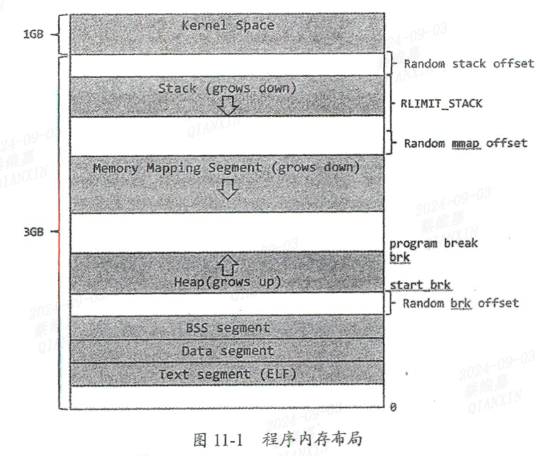
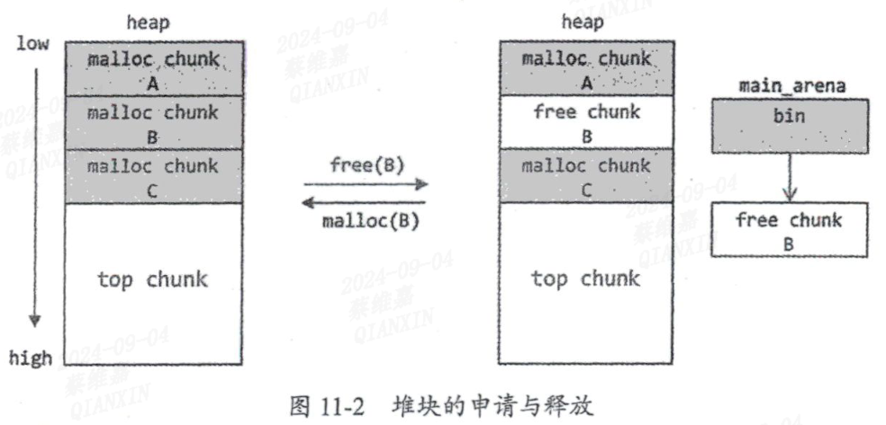
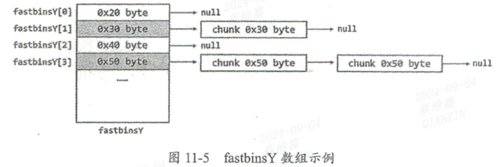
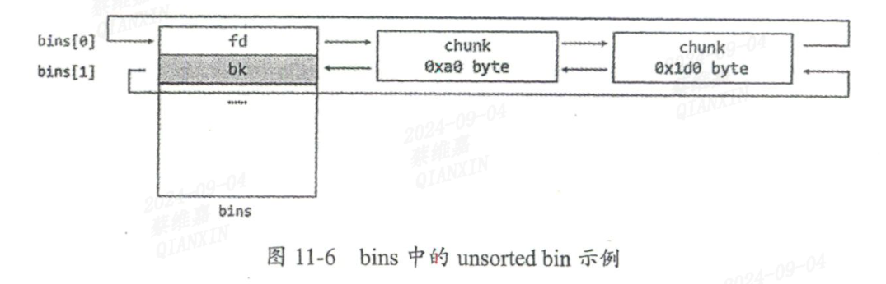
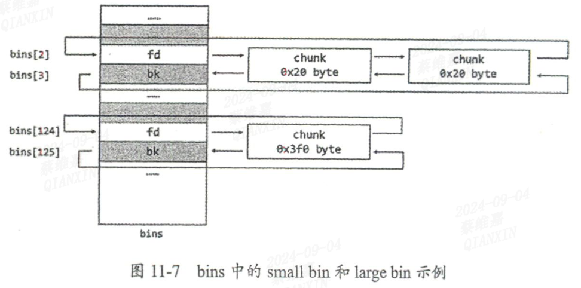

# about Heap
[glibc offcial MallocInternals](https://sourceware.org/glibc/wiki/MallocInternals)

## common terms
**Arena**
A structure that is shared among one or more threads which contains references to one or more heaps, as well as linked lists of chunks within those heaps which are "free". Threads assigned to each arena will allocate memory from that arena's free lists.
**Heap**
A contiguous region of memory that is subdivided into chunks to be allocated. Each heap belongs to exactly one arena. 一块连续的内存，根据需要切分为 chunk 作为对分配的单位。
**Chunk**
A small range of memory that can be allocated (owned by the application), freed (owned by glibc), or combined with adjacent chunks into larger ranges. Note that a chunk is a wrapper around the block of memory that is given to the application. Each chunk exists in one heap and belongs to one arena.
**Memory**
A portion of the application's address space which is typically backed by RAM or swap.


## What is a Chunk?
Glibc's malloc is chunk-oriented. It divides a large region of memory (a "heap") into chunks of **various sizes**. Each chunk includes meta-data about how big it is (via a **`size` field in the chunk header**), and thus **where the adjacent chunks are.相邻chunk** When a chunk is in use by the application, the only data that's "remembered" is the size of the chunk. When the chunk is free'd, the memory that used to be application data is re-purposed for additional arena-related information, such as pointers within linked lists, such that suitable chunks can quickly be found and re-used when needed. 


Since all chunks are multiples of 8 bytes, the 3 LSBs of the chunk size can be used for flags. These three flags are defined as follows:
- A (0x04)
**Allocated Arena** - the main arena uses the application's heap. Other arenas use mmap'd heaps. To map a chunk to a heap, you need to know which case applies. If this bit is 0, the chunk comes from the main arena and the main heap. If this bit is 1, the chunk comes from mmap'd memory and the location of the heap can be computed from the chunk's address.
- M (0x02)
MMap'd chunk - this chunk was allocated with a single call to `mmap` and is not part of a heap at all.

- P (0x01)
**Previous chunk is in use - if set,** the previous chunk is still being used by the application, and thus the prev_size field is invalid. Note - some chunks, such as those in fastbins (see below) will have this bit set despite being free'd by the application. This bit really means that the previous chunk should not be considered a candidate for coalescing - it's "in use" by either the application or some other optimization layered atop malloc's original code 



Note that, since chunks are adjacent to each other in memory, if you know the address of **the first chunk (lowest address) in a heap**, you can** iterate through all the chunks in the heap by using the size information**, but only by increasing address, although it may be difficult to detect when you've hit the last chunk in the heap.


堆是程序虚拟内存中由**低地址向高地址增长**的**线性区域**，一般只有当用户向操作系统发起内存申请时。这片区域才会被内核分配出来，并且处于效率和页对齐的考虑，通常会分配相当大的**连续内存**。程序再次申请时便会从这篇内存中进行分配，**直到堆空间不能满足时才会再次增长**。另，堆的位置一般在**BSS 段高地址处**。

**常见堆管理机制**
- ptmalloc2, 
- dlmalloc
- tcmalloc
- jemalloc

**brk() & sbrk()**
堆的属性时可读可写的，大小通过 brk() 或 sbrk()函数进行控制。
如下图所示，在堆未初始化时，program_break 指向 BSS段的末尾，通过调用 brk() 或 sbrk() 来移动 program_break 使堆增长。

在堆初始化时，如果开启了 ASLR，则堆的起始地址 start_brk 会在 BSS段之后的随机位移处，如果没有开启，则 strat_brk 则会紧接着 BSS段。 也就是说，stark_brk 到 program_break 之间是堆空间


brk() 函数的参数是一个指针，用于设置 program_break 的位置。 sbrk() 函数的参数 increment 用于与 program_break 相加来调整 program_break。


**glibc 中的堆**
- 堆块申请 -> 从堆中按顺序分配堆块给用户，用户持有指向这些堆块的指针。 **allocated chunk**
- 堆块释放 -> glibc 会将释放的堆块组织成链表；当相邻堆块都为释放状态，则将之合并位新的堆块，解决内存碎片的问题。 **free chunk**

**bin**: 由 free chunk 组成的堆块链表。
glibc 根据大小范围将 chunk组织成不同的 bin。
- fast bin  -> 由 fast chunk 组成
- small bin -> 由 small chunk 组成
- large bin -> 由 large chunk 组成

**重要概念及结构体**
- arena
- heap_info
- malloc_state
- malloc_chunk

**arena** 包含一篇或数片连续的内存，堆块将会从这片区域划分给用户。主线程 arena 称为 main_arena，它包含 start_brk 和 brk 之间的这篇连续内存。
主线程的 arena 只有堆，子线程 arena 可以有数片连续内存。如果主线程的堆大小不够分，则可以通过 brk() 进行拓展，
但子线程分配的映射段大小是固定的，不可以拓展，所以子线程分配出来的一段映射段不够的话，则需要再次使用 mmap() 来分配新的内存。

**heap info**
子线程的 arena 可以包含多片连续内存，这些内存被称为 heap。每个 heap 都有其 heap header，由结构体 heap_info 维护，并以链表形式进行连接
```c
typedef struct _heap_info
{
  mstate ar_ptr; /* Arena for this heap. */
  struct _heap_info *prev; /* Previous heap. */
  size_t size;   /* Current size in bytes. */
  size_t mprotect_size; /* Size in bytes that has been mprotected
                           PROT_READ|PROT_WRITE.  */
  /* Make sure the following data is properly aligned, particularly
     that sizeof (heap_info) + 2 * SIZE_SZ is a multiple of
     MALLOC_ALIGNMENT. */
  char pad[-6 * SIZE_SZ & MALLOC_ALIGN_MASK];
} heap_info;
```

**malloc_state**
每个线程只有一个 arena header，保存了 bins、top chunk 等信息。主线程的 main_arena 保存在 libc.so 的数据段里，其他线程的 arena 则保存在给当前 arena 分配的 heap 里。相关数据结构为 malloc_state
```C
struct malloc_state
{
  /* Serialize access.  */
  __libc_lock_define (, mutex);
  /* Flags (formerly in max_fast).  */
  int flags;

  /* Fastbins */
  mfastbinptr fastbinsY[NFASTBINS];
  /* Base of the topmost chunk -- not otherwise kept in a bin */
  mchunkptr top;
  /* The remainder from the most recent split of a small request */
  mchunkptr last_remainder;
  /* Normal bins packed as described above */
  mchunkptr bins[NBINS * 2 - 2];

  /* Bitmap of bins */
  unsigned int binmap[BINMAPSIZE];

  /* Linked list */
  struct malloc_state *next;
  /* Linked list for free arenas.  Access to this field is serialized
     by free_list_lock in arena.c.  */
  struct malloc_state *next_free;
  /* Number of threads attached to this arena.  0 if the arena is on
     the free list.  Access to this field is serialized by
     free_list_lock in arena.c.  */

  INTERNAL_SIZE_T attached_threads;
  /* Memory allocated from the system in this arena.  */
  INTERNAL_SIZE_T system_mem;
  INTERNAL_SIZE_T max_system_mem;
};

typedef struct malloc_state *mstate;
```

**malloc_chunk**
chunk 是 glibc 管理内存的基本单位，整个堆在初始化后会被当成一个 free chunk，这个 chunk 称位 top chunk。
每次用户请求内存，如果 bins 中没有合适的 chunk，malloc 就会从 top chunk 进行划分，如果 top chunk 不够，则调用 brk() 进行堆扩展，随后再从新的 top chunk 进行划分。
用户释放内存时，glibc 会先根据情况将释放的 chunk 与其他相邻的 free chunk 合并。随后加入合适的 bin 中


A、B、C 为用户申请的堆块 chunks，此时释放 chunk B，由于 chunk B 并不与 top chunk 相邻，因此会被回收到 bins 链表中，此时用户如果申请 chunk B 相同大小的堆块，则直接从 bins 中进行分配，而不是在 top chunk 进行划分。
如果用户连续释放 chunk A&B，因为这两个 chunk 是相邻的，因此会被合成一块 free chunk 但合并之后的并不与 top chunk 相邻，因此同样会被 bins 进行回收。

**可以发现，chunk的状态信息会随着内存的分配、释放而变动，那么，glibc 是如何记录每个 chunk 的大小、状态和指针等描述 chunk 状态信息的呢？-> malloc_chunk**
```c
struct malloc_chunk {
  INTERNAL_SIZE_T      mchunk_prev_size;  /* Size of previous chunk, if it is free. 若当前 chunk 并非 free，则这个字段会归于上一个 chunk 的使用空间*/
  INTERNAL_SIZE_T      mchunk_size;       /* Size in bytes, including overhead. */
  struct malloc_chunk* fd;                /* double links -- used only if this chunk is free. 间接表示当前 chunk 是否为 free chunk*/
  struct malloc_chunk* bk;
  /* Only used for large blocks: pointer to next larger size.  */
  struct malloc_chunk* fd_nextsize; /* double links -- used only if this chunk is free. */
  struct malloc_chunk* bk_nextsize;
};

typedef struct malloc_chunk* mchunkptr;
```
- INTERNAL_SIZE_T 默认情况下，在 64位系统中是 8bytes，在 32位系统中是 4bytes。
- fd & bk（front & back），当前 chunk 是 free chunk 时有效。当 chunk 被释放，会被回收到相应的 bin 中，此时 fd 和 bk 指向当前 bin 链表中的上一块和下一块 free chunk。
- fd_nextsize & bk_nextsize，指示相应的 free chunk 大小，同样是当前 chunk 是 free chunk 时有效。不同的是，这两个成员**仅用于 large bin**，**分别指向前后第一个`和当前 chunk 不同`的 large chunk**
ps: 当前块并非 free chunk（正在被用户使用），则 fd 和 bk 的几个成员无效，空间是用户可以使用的空间

**Allocted chunk**
```shell
    chunk-> +-+-+-+-+-+-+-+-+-+-+-+-+-+-+-+-+-+-+-+-+-+-+-+-+-+-+-+-+-+-+-+-+
            |             Size of previous chunk, if unallocated (P clear)  |
            +-+-+-+-+-+-+-+-+-+-+-+-+-+-+-+-+-+-+-+-+-+-+-+-+-+-+-+-+-+-+-+-+
            |             Size of chunk, in bytes                     |A|M|P|
      mem-> +-+-+-+-+-+-+-+-+-+-+-+-+-+-+-+-+-+-+-+-+-+-+-+-+-+-+-+-+-+-+-+-+
            |             User data starts here...                          .
            .                                                               .
            .             (malloc_usable_size() bytes)                      .
            .                                                               |
nextchunk-> +-+-+-+-+-+-+-+-+-+-+-+-+-+-+-+-+-+-+-+-+-+-+-+-+-+-+-+-+-+-+-+-+
            |             (size of chunk, but used for application data)    |
            +-+-+-+-+-+-+-+-+-+-+-+-+-+-+-+-+-+-+-+-+-+-+-+-+-+-+-+-+-+-+-+-+
            |             Size of next chunk, in bytes                |A|0|1|
            +-+-+-+-+-+-+-+-+-+-+-+-+-+-+-+-+-+-+-+-+-+-+-+-+-+-+-+-+-+-+-+-+
```
**Free chunk**
```shell
    chunk-> +-+-+-+-+-+-+-+-+-+-+-+-+-+-+-+-+-+-+-+-+-+-+-+-+-+-+-+-+-+-+-+-+
            |             Size of previous chunk, if unallocated (P clear)  |
            +-+-+-+-+-+-+-+-+-+-+-+-+-+-+-+-+-+-+-+-+-+-+-+-+-+-+-+-+-+-+-+-+
    `head:' |             Size of chunk, in bytes                     |A|0|P|
      mem-> +-+-+-+-+-+-+-+-+-+-+-+-+-+-+-+-+-+-+-+-+-+-+-+-+-+-+-+-+-+-+-+-+
            |             Forward pointer to next chunk in list             |
            +-+-+-+-+-+-+-+-+-+-+-+-+-+-+-+-+-+-+-+-+-+-+-+-+-+-+-+-+-+-+-+-+
            |             Back pointer to previous chunk in list            |
            +-+-+-+-+-+-+-+-+-+-+-+-+-+-+-+-+-+-+-+-+-+-+-+-+-+-+-+-+-+-+-+-+
            |             Unused space (may be 0 bytes long)                .
            .                                                               .
            .                                                               |
nextchunk-> +-+-+-+-+-+-+-+-+-+-+-+-+-+-+-+-+-+-+-+-+-+-+-+-+-+-+-+-+-+-+-+-+
    `foot:' |             Size of chunk, in bytes                           |
            +-+-+-+-+-+-+-+-+-+-+-+-+-+-+-+-+-+-+-+-+-+-+-+-+-+-+-+-+-+-+-+-+
            |             Size of next chunk, in bytes                |A|0|0|
            +-+-+-+-+-+-+-+-+-+-+-+-+-+-+-+-+-+-+-+-+-+-+-+-+-+-+-+-+-+-+-+-+
```

## Sorts of bin
1. fast bin 
2. small bin
3. large bin
4. unsorted bin
这些 bin 记录在 malloc_state 结构中：
- fastbinsY，这是一个 bin 数组，包含 NFASTBINS 个 fast bin
- bins，同样是一个 bin 数组，一共有 126 个bin，按照顺序分别是：
  - bin1 为 unsorted bin
  - bin2 -> bin63 为 small bin
  - bin64 -> bin126 为 large bin
### fast bin
**在实践中，程序申请和释放的堆块往往比较小**，因此 glibc 对这类 bin 使用单链表结构，并采取 LIFO 的分配策略。同时为了加快速度，fast bin 中的 chunk 并**不会进行合并操作**，所以下一个 chunk 的 AMP flags 中的 P 始终为1，标记其处于使用状态，规避合并操作。**同一个 fast bin 中的 chunk 大小相同**，并且在 fastbinsY 数组中按照从小到大的排列顺序，**序号为0的 fast bin 中容纳的 chunk 大小为 4 * SIZE_SZ 字节**，随着序号的增加，所容纳的 **chunk 递增 2*SIZE_SZ 字节**，以 64位系统为例：


### unsorted bin
一定大小的 chunk 被释放时，在进入 small bin 或 large bin 之前会被先添加到 unsorted bin。**在实践中，一个被释放的 chunk 常常很快就会被重新使用**，所以将其先加入 unsorted bin 可以加快分配的速度。

unsorted bin 采取双链表结构，并使用 FIFO 的分配策略，与 fast bin 不同的是 unsorted bin 中的 **chunk 大小可能不一致**，并且由于是双链表结构，一个 bin 会占用 bins 的两个元素，如下图：


### small bin
**同一个 small bin 中的 chunk 大小一致**，采用双链表结构，使用频率介于 fast bin 和 large bin 之间。small bin 在 bins 中占 2-63位，共62个。*
根据排序，每个 small bin 的大小位 2\*SIZE_SZ\*idx (idx 是 bins 数组下标)，以 64位系统为例，最小的 small bin 在 bins 序列中的第2位，其中的 chunk 大小：2\*8\*2 = 32 bytes，最大的 small bin 中的 chunk 大小为：2\*8\*63 = 1008 bytes. **另**，small bin 和 fast bin 有重合的部分，所以这些 chunk 在某些情况下会被加入 small bin 中。


### large bin
large bin 在 bins 数组的位于第64 - 126位，共63个，分成6组，每组 bin 所能容纳的 chunk 按顺序排成等差数列，公差分别如下：
```shell
    32  bins of size        64
    16  bins of size        512
     8  bins of size       4096
     4  bins of size      32768
     2  bins of size     262144
     1  bins of size   what's left    
```
large bin t同样采取双链表的结构，其 chunk 从头节点的 fd 指针开始，按大小顺序进行排列。为了加快检索速度， fd_nextsize 和 bk_nextsize指针用于指向第一个与自己大小不同的chunk，因此只有当加入了大小不同的 chunk 时，这
